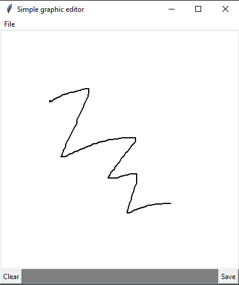

# GraphEditor

# Simple graphics editor in Python

This simple graphics editor is created using the Tkinter library and the Pillow library for saving images.

## Peculiarities

- Drawing on canvas
- Cleaning the canvas
- Save image

## How to use

1. Launch the application.
2. Draw on the canvas while holding down the left mouse button.
3. To clear the canvas, click the "Clear" button.
4. To save the image, select "File" -> "Save" and specify the path to the file.

## Requirements

- Python 3
- Tkinter Library
- Pillow Library (PIL)

## Installing dependencies

```bash
pip install Pillow
```
